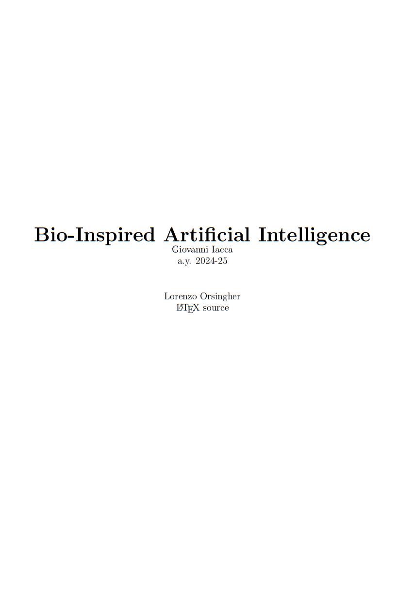

# Bio-Inspired Artificial Intelligence notes

The notes are mostly AI generated integrating the content from the slides and the transcript of the lectures, so just be aware. This is still a viable resource for preparing the exam, all chapters are covered, and the notes are quite detailed.

<p align="center">
<a href="https://github.com/lorenzoorsingher/BIOAI_notes/blob/main/main.pdf"></a>
</p>
<p align="center">
Click to download notes
</p>

## Project Structure

```
├── chapters
│   ├── chapter1.tex
│   ├── chapter2.tex
│   ├── chapter3.tex
│   ├── chapter4.tex
│   ├── chapter5.tex
│   ├── chapter6.tex
│   ├── chapter7.tex
│   ├── chapter8.tex
│   ├── chapter9.tex
│   ├── chapter10.tex
│   ├── chapter11.tex
│   └── chapter12.tex
├── main.tex
├── main.pdf
└── README.md
```

## Compiling the Document

To compile the LaTeX document, follow these steps:

1. Ensure you have a LaTeX distribution installed (e.g., TeX Live, MiKTeX).
2. Open a terminal and navigate to the project home directory.
3. Run the following command to compile the main file:

   ```
   pdflatex main.tex
   ```

4. You may need to run the command multiple times to ensure the table of contents is updated correctly.

## Authors

- [lorenzoorsingher](https://www.github.com/lorenzoorsingher)
- [GitHub repo](https://github.com/lorenzoorsingher/BIOAI_notes)
